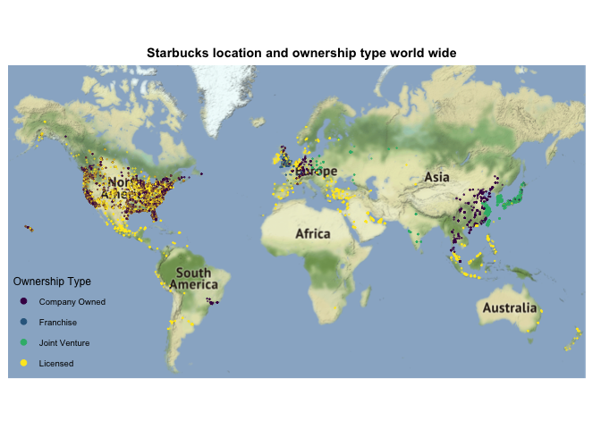
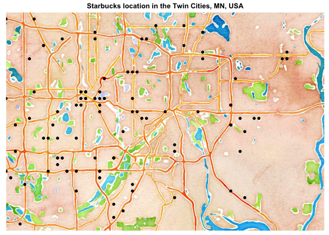
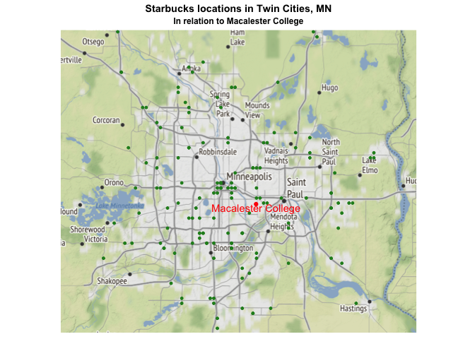
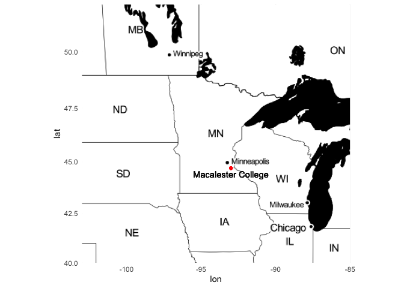

```r
library(tidyverse)     # for data cleaning and plotting
```

```
## ── Attaching packages ─────────────────────────────────────── tidyverse 1.3.0 ──
```

```
## ✓ ggplot2 3.3.3     ✓ purrr   0.3.4
## ✓ tibble  3.0.5     ✓ dplyr   1.0.3
## ✓ tidyr   1.1.2     ✓ stringr 1.4.0
## ✓ readr   1.4.0     ✓ forcats 0.5.0
```

```
## ── Conflicts ────────────────────────────────────────── tidyverse_conflicts() ──
## x dplyr::filter() masks stats::filter()
## x dplyr::lag()    masks stats::lag()
```

```r
library(lubridate)     # for date manipulation
```

```
## 
## Attaching package: 'lubridate'
```

```
## The following objects are masked from 'package:base':
## 
##     date, intersect, setdiff, union
```

```r
library(openintro)     # for the abbr2state() function
```

```
## Loading required package: airports
```

```
## Loading required package: cherryblossom
```

```
## Loading required package: usdata
```

```r
library(palmerpenguins)# for Palmer penguin data
library(maps)          # for map data
```

```
## 
## Attaching package: 'maps'
```

```
## The following object is masked from 'package:purrr':
## 
##     map
```

```r
library(ggmap)         # for mapping points on maps
```

```
## Google's Terms of Service: https://cloud.google.com/maps-platform/terms/.
```

```
## Please cite ggmap if you use it! See citation("ggmap") for details.
```

```r
library(gplots)        # for col2hex() function
```

```
## 
## Attaching package: 'gplots'
```

```
## The following object is masked from 'package:stats':
## 
##     lowess
```

```r
library(RColorBrewer)  # for color palettes
library(sf)            # for working with spatial data
```

```
## Linking to GEOS 3.8.1, GDAL 3.1.4, PROJ 6.3.1
```

```r
library(leaflet)       # for highly customizable mapping
library(carData)       # for Minneapolis police stops data
library(ggthemes)      # for more themes (including theme_map())
theme_set(theme_minimal())
```


```r
# Starbucks locations
Starbucks <- read_csv("https://www.macalester.edu/~ajohns24/Data/Starbucks.csv")
```

```
## 
## ── Column specification ────────────────────────────────────────────────────────
## cols(
##   Brand = col_character(),
##   `Store Number` = col_character(),
##   `Store Name` = col_character(),
##   `Ownership Type` = col_character(),
##   `Street Address` = col_character(),
##   City = col_character(),
##   `State/Province` = col_character(),
##   Country = col_character(),
##   Postcode = col_character(),
##   `Phone Number` = col_character(),
##   Timezone = col_character(),
##   Longitude = col_double(),
##   Latitude = col_double()
## )
```

```r
starbucks_us_by_state <- Starbucks %>% 
  filter(Country == "US") %>% 
  count(`State/Province`) %>% 
  mutate(state_name = str_to_lower(abbr2state(`State/Province`))) 

# Lisa's favorite St. Paul places - example for you to create your own data
favorite_stp_by_lisa <- tibble(
  place = c("Home", "Macalester College", "Adams Spanish Immersion", 
            "Spirit Gymnastics", "Bama & Bapa", "Now Bikes",
            "Dance Spectrum", "Pizza Luce", "Brunson's"),
  long = c(-93.1405743, -93.1712321, -93.1451796, 
           -93.1650563, -93.1542883, -93.1696608, 
           -93.1393172, -93.1524256, -93.0753863),
  lat = c(44.950576, 44.9378965, 44.9237914,
          44.9654609, 44.9295072, 44.9436813, 
          44.9399922, 44.9468848, 44.9700727)
  )

#COVID-19 data from the New York Times
covid19 <- read_csv("https://raw.githubusercontent.com/nytimes/covid-19-data/master/us-states.csv")
```

```
## 
## ── Column specification ────────────────────────────────────────────────────────
## cols(
##   date = col_date(format = ""),
##   state = col_character(),
##   fips = col_character(),
##   cases = col_double(),
##   deaths = col_double()
## )
```

## Instructions

* **For ALL graphs, you should include appropriate labels.** 

* When you are finished with ALL the exercises, uncomment the options at the top so your document looks nicer. Don't do it before then, or else you might miss some important warnings and messages.


## Warm-up exercises from tutorial

These exercises will reiterate what you learned in the "Mapping data with R" tutorial. If you haven't gone through the tutorial yet, you should do that first.

### Starbucks locations (`ggmap`)

  1. Add the `Starbucks` locations to a world map. Add an aesthetic to the world map that sets the color of the points according to the ownership type. What, if anything, can you deduce from this visualization?  
  

```r
# Get the map information
world <- get_stamenmap(
    bbox = c(left = -180, bottom = -57, right = 179, top = 82.1), 
    maptype = "terrain",
    zoom = 2)
```

```
## Source : http://tile.stamen.com/terrain/2/0/0.png
```

```
## Source : http://tile.stamen.com/terrain/2/1/0.png
```

```
## Source : http://tile.stamen.com/terrain/2/2/0.png
```

```
## Source : http://tile.stamen.com/terrain/2/3/0.png
```

```
## Source : http://tile.stamen.com/terrain/2/0/1.png
```

```
## Source : http://tile.stamen.com/terrain/2/1/1.png
```

```
## Source : http://tile.stamen.com/terrain/2/2/1.png
```

```
## Source : http://tile.stamen.com/terrain/2/3/1.png
```

```
## Source : http://tile.stamen.com/terrain/2/0/2.png
```

```
## Source : http://tile.stamen.com/terrain/2/1/2.png
```

```
## Source : http://tile.stamen.com/terrain/2/2/2.png
```

```
## Source : http://tile.stamen.com/terrain/2/3/2.png
```

```r
# Plot the points on the map
ggmap(world) + # creates the map "background"
  geom_point(data = Starbucks, 
             aes(x = Longitude, y = Latitude, color = "Ownership Type"), alpha = .3, size = .1) +
  theme_map()
```

```
## Warning: Removed 1 rows containing missing values (geom_point).
```

<!-- -->


  2. Construct a new map of Starbucks locations in the Twin Cities metro area (approximately the 5 county metro area).  


```r
starbucks_us_by_state <- Starbucks %>% 
  filter(Country == "US") %>% 
  count(`State/Province`) %>% 
  mutate(state_name = str_to_lower(abbr2state(`State/Province`))) 

#US states map information - coordinates used to draw borders
states_map <- map_data("state")
```


  3. In the Twin Cities plot, play with the zoom number. What does it do?  (just describe what it does - don't actually include more than one map).  


```r
world <- get_stamenmap(
    bbox = c(left = -103, bottom = 40, right = -85, top = 52), 
    maptype = "terrain",
    zoom = 5)
```

```
## Source : http://tile.stamen.com/terrain/5/6/10.png
```

```
## Source : http://tile.stamen.com/terrain/5/7/10.png
```

```
## Source : http://tile.stamen.com/terrain/5/8/10.png
```

```
## Source : http://tile.stamen.com/terrain/5/6/11.png
```

```
## Source : http://tile.stamen.com/terrain/5/7/11.png
```

```
## Source : http://tile.stamen.com/terrain/5/8/11.png
```

```
## Source : http://tile.stamen.com/terrain/5/6/12.png
```

```
## Source : http://tile.stamen.com/terrain/5/7/12.png
```

```
## Source : http://tile.stamen.com/terrain/5/8/12.png
```

```r
ggmap(world)
```

<!-- -->

* The zoom number is the level of details that you want your map to show. Smaller numbers show less detail and larger numbers show more. 

$~$

  4. Try a couple different map types (see `get_stamenmap()` in help and look at `maptype`). Include a map with one of the other map types.  


```r
world <- get_stamenmap(
    bbox = c(left = -103, bottom = 40, right = -85, top = 52), 
    maptype = "toner-2010",
    zoom = 5)
```

```
## Source : http://tile.stamen.com/toner-2010/5/6/10.png
```

```
## Source : http://tile.stamen.com/toner-2010/5/7/10.png
```

```
## Source : http://tile.stamen.com/toner-2010/5/8/10.png
```

```
## Source : http://tile.stamen.com/toner-2010/5/6/11.png
```

```
## Source : http://tile.stamen.com/toner-2010/5/7/11.png
```

```
## Source : http://tile.stamen.com/toner-2010/5/8/11.png
```

```
## Source : http://tile.stamen.com/toner-2010/5/6/12.png
```

```
## Source : http://tile.stamen.com/toner-2010/5/7/12.png
```

```
## Source : http://tile.stamen.com/toner-2010/5/8/12.png
```

```r
ggmap(world)
```

<!-- -->

$~$


  5. Add a point to the map that indicates Macalester College and label it appropriately. There are many ways you can do this, but I think it's easiest with the `annotate()` function (see `ggplot2` cheatsheet).


```r
world <- get_stamenmap(
    bbox = c(left = -103, bottom = 40, right = -85, top = 52), 
    maptype = "toner",
    zoom = 5)
```

```
## Source : http://tile.stamen.com/toner/5/6/10.png
```

```
## Source : http://tile.stamen.com/toner/5/7/10.png
```

```
## Source : http://tile.stamen.com/toner/5/8/10.png
```

```
## Source : http://tile.stamen.com/toner/5/6/11.png
```

```
## Source : http://tile.stamen.com/toner/5/7/11.png
```

```
## Source : http://tile.stamen.com/toner/5/8/11.png
```

```
## Source : http://tile.stamen.com/toner/5/6/12.png
```

```
## Source : http://tile.stamen.com/toner/5/7/12.png
```

```
## Source : http://tile.stamen.com/toner/5/8/12.png
```

```r
ggmap(world) +
  geom_point(aes(x = -93, y = 44.7), color = "red") + 
  geom_text(aes(x = -93, y = 44.4, label = "Macalester College"))
```

<!-- -->

$~$


### Choropleth maps with Starbucks data (`geom_map()`)

The example I showed in the tutorial did not account for population of each state in the map. In the code below, a new variable is created, `starbucks_per_10000`, that gives the number of Starbucks per 10,000 people. It is in the `starbucks_with_2018_pop_est` dataset.


```r
census_pop_est_2018 <- read_csv("https://www.dropbox.com/s/6txwv3b4ng7pepe/us_census_2018_state_pop_est.csv?dl=1") %>% 
  separate(state, into = c("dot","state"), extra = "merge") %>% 
  select(-dot) %>% 
  mutate(state = str_to_lower(state))
```

```
## 
## ── Column specification ────────────────────────────────────────────────────────
## cols(
##   state = col_character(),
##   est_pop_2018 = col_double()
## )
```

```r
starbucks_with_2018_pop_est <-
  starbucks_us_by_state %>% 
  left_join(census_pop_est_2018,
            by = c("state_name" = "state")) %>% 
  mutate(starbucks_per_10000 = (n/est_pop_2018)*10000)
```

  6. **`dplyr` review**: Look through the code above and describe what each line of code does.
  * 

  7. Create a choropleth map that shows the number of Starbucks per 10,000 people on a map of the US. Use a new fill color, add points for all Starbucks in the US (except Hawaii and Alaska), add an informative title for the plot, and include a caption that says who created the plot (you!). Make a conclusion about what you observe.

### A few of your favorite things (`leaflet`)

  8. In this exercise, you are going to create a single map of some of your favorite places! The end result will be one map that satisfies the criteria below. 

  * Create a data set using the `tibble()` function that has 10-15 rows of your favorite places. The columns will be the name of the location, the latitude, the longitude, and a column that indicates if it is in your top 3 favorite locations or not. For an example of how to use `tibble()`, look at the `favorite_stp_by_lisa` I created in the data R code chunk at the beginning.  

  * Create a `leaflet` map that uses circles to indicate your favorite places. Label them with the name of the place. Choose the base map you like best. Color your 3 favorite places differently than the ones that are not in your top 3 (HINT: `colorFactor()`). Add a legend that explains what the colors mean.  
  
  * Connect all your locations together with a line in a meaningful way (you may need to order them differently in the original data).  
  
  * If there are other variables you want to add that could enhance your plot, do that now.  
  
## Revisiting old datasets

This section will revisit some datasets we have used previously and bring in a mapping component. 

### Bicycle-Use Patterns

The data come from Washington, DC and cover the last quarter of 2014.

Two data tables are available:

- `Trips` contains records of individual rentals
- `Stations` gives the locations of the bike rental stations

Here is the code to read in the data. We do this a little differently than usualy, which is why it is included here rather than at the top of this file. To avoid repeatedly re-reading the files, start the data import chunk with `{r cache = TRUE}` rather than the usual `{r}`. This code reads in the large dataset right away.


```r
data_site <- 
  "https://www.macalester.edu/~dshuman1/data/112/2014-Q4-Trips-History-Data.rds" 
Trips <- readRDS(gzcon(url(data_site)))
Stations<-read_csv("http://www.macalester.edu/~dshuman1/data/112/DC-Stations.csv")
```

```
## 
## ── Column specification ────────────────────────────────────────────────────────
## cols(
##   name = col_character(),
##   lat = col_double(),
##   long = col_double(),
##   nbBikes = col_double(),
##   nbEmptyDocks = col_double()
## )
```

  9. Use the latitude and longitude variables in `Stations` to make a visualization of the total number of departures from each station in the `Trips` data. Use either color or size to show the variation in number of departures. This time, plot the points on top of a map. Use any of the mapping tools you'd like.
  

  
  10. Only 14.4% of the trips in our data are carried out by casual users. Create a plot that shows which area(s) have stations with a much higher percentage of departures by casual users. What patterns do you notice? Also plot this on top of a map. I think it will be more clear what the patterns are.
  

  
### COVID-19 data

The following exercises will use the COVID-19 data from the NYT.

  11. Create a map that colors the states by the most recent cumulative number of COVID-19 cases (remember, these data report cumulative numbers so you don't need to compute that). Describe what you see. What is the problem with this map?
  
  12. Now add the population of each state to the dataset and color the states by most recent cumulative cases/10,000 people. See the code for doing this with the Starbucks data. You will need to make some modifications. 
  
  13. **CHALLENGE** Choose 4 dates spread over the time period of the data and create the same map as in exercise 12 for each of the dates. Display the four graphs together using faceting. What do you notice?
  
## Minneapolis police stops

These exercises use the datasets `MplsStops` and `MplsDemo` from the `carData` library. Search for them in Help to find out more information.

  14. Use the `MplsStops` dataset to find out how many stops there were for each neighborhood and the proportion of stops that were for a suspicious vehicle or person. Sort the results from most to least number of stops. Save this as a dataset called `mpls_suspicious` and display the table.  
  
  15. Use a `leaflet` map and the `MplsStops` dataset to display each of the stops on a map as a small point. Color the points differently depending on whether they were for suspicious vehicle/person or a traffic stop (the `problem` variable). HINTS: use `addCircleMarkers`, set `stroke = FAlSE`, use `colorFactor()` to create a palette.  
  
  16. Save the folder from moodle called Minneapolis_Neighborhoods into your project/repository folder for this assignment. Make sure the folder is called Minneapolis_Neighborhoods. Use the code below to read in the data and make sure to **delete the `eval=FALSE`**. Although it looks like it only links to the .sph file, you need the entire folder of files to create the `mpls_nbhd` data set. These data contain information about the geometries of the Minneapolis neighborhoods. Using the `mpls_nbhd` dataset as the base file, join the `mpls_suspicious` and `MplsDemo` datasets to it by neighborhood (careful, they are named different things in the different files). Call this new dataset `mpls_all`.


```r
mpls_nbhd <- st_read("Minneapolis_Neighborhoods/Minneapolis_Neighborhoods.shp", quiet = TRUE)
```

  17. Use `leaflet` to create a map from the `mpls_all` data  that colors the neighborhoods by `prop_suspicious`. Display the neighborhood name as you scroll over it. Describe what you observe in the map.
  
  18. Use `leaflet` to create a map of your own choosing. Come up with a question you want to try to answer and use the map to help answer that question. Describe what your map shows. 
  
  
## GitHub link

  19. Below, provide a link to your GitHub page with this set of Weekly Exercises. Specifically, if the name of the file is 04_exercises.Rmd, provide a link to the 04_exercises.md file, which is the one that will be most readable on GitHub.


**DID YOU REMEMBER TO UNCOMMENT THE OPTIONS AT THE TOP?**
